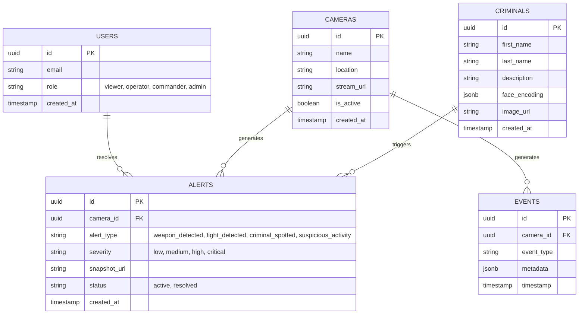

# Database Entity-Relationship Diagram

```mermaid
erDiagram
    USERS {
        uuid id PK
        string email
        string role "viewer, operator, commander, admin"
        timestamp created_at
    }

    CAMERAS {
        uuid id PK
        string name
        string location
        string stream_url
        boolean is_active
        timestamp created_at
    }

    ALERTS {
        uuid id PK
        uuid camera_id FK
        string alert_type "weapon_detected, fight_detected, criminal_spotted, suspicious_activity"
        string severity "low, medium, high, critical"
        string snapshot_url
        string status "active, resolved"
        timestamp created_at
    }

    CRIMINALS {
        uuid id PK
        string first_name
        string last_name
        string description
        jsonb face_encoding
        string image_url
        timestamp created_at
    }

    EVENTS {
        uuid id PK
        uuid camera_id FK
        string event_type
        jsonb metadata
        timestamp timestamp
    }

    USERS ||--o{ ALERTS : "resolves"
    CAMERAS ||--o{ ALERTS : "generates"
    CAMERAS ||--o{ EVENTS : "generates"
    CRIMINALS ||--o{ ALERTS : "triggers"
```
