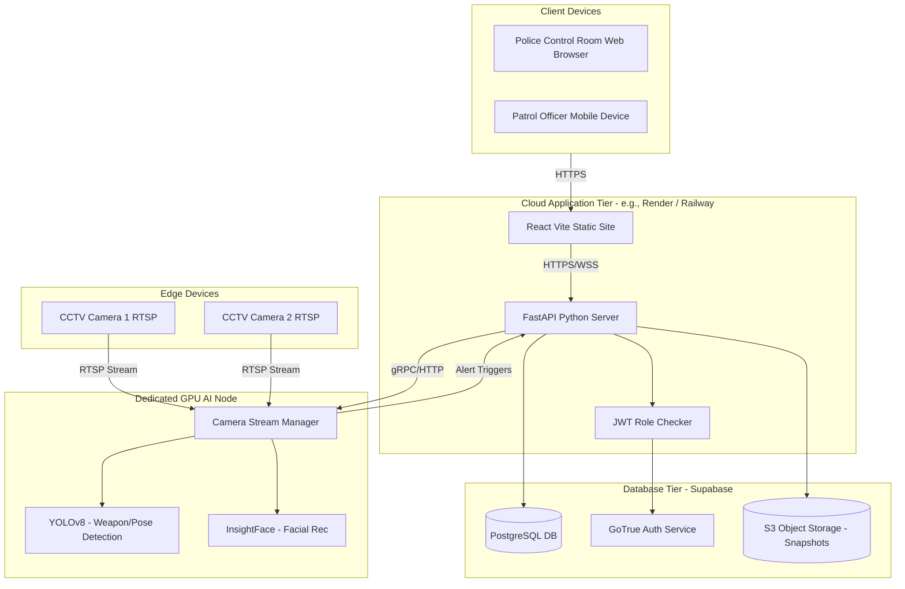

# Sentinel AI - Deployment Diagram

```mermaid
graph TD
    subgraph Client [Client Devices]
        WebBrowser[Police Control Room Web Browser]
        MobileApp[Patrol Officer Mobile Device]
    end

    subgraph PaaS_Render [Cloud Application Tier - e.g., Render / Railway]
        Frontend[React Vite Static Site]
        BackendAPI[FastAPI Python Server]
        AuthService[JWT Role Checker]
        
        Frontend --> |HTTPS/WSS| BackendAPI
        BackendAPI --> AuthService
    end

    subgraph GPU_Node [Dedicated GPU AI Node]
        StreamMgr[Camera Stream Manager]
        YOLO[YOLOv8 - Weapon/Pose Detection]
        InsightFace[InsightFace - Facial Rec]
        
        BackendAPI --> |gRPC/HTTP| StreamMgr
        StreamMgr --> YOLO
        StreamMgr --> InsightFace
    end

    subgraph DBaaS_Supabase [Database Tier - Supabase]
        PostgreSQL[(PostgreSQL DB)]
        GoTrue[GoTrue Auth Service]
        S3Storage[(S3 Object Storage - Snapshots)]
        
        AuthService --> GoTrue
        BackendAPI --> PostgreSQL
        BackendAPI --> S3Storage
        StreamMgr --> |Alert Triggers| BackendAPI
    end

    subgraph Cameras [Edge Devices]
        CCTV1[CCTV Camera 1 RTSP]
        CCTV2[CCTV Camera 2 RTSP]
        
        CCTV1 --> |RTSP Stream| StreamMgr
        CCTV2 --> |RTSP Stream| StreamMgr
    end

    Client --> |HTTPS| Frontend
```
